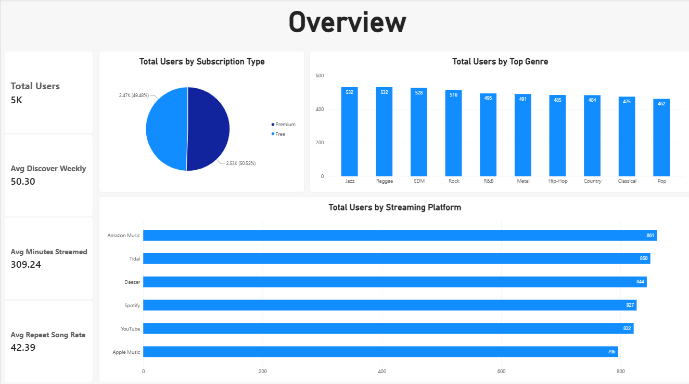
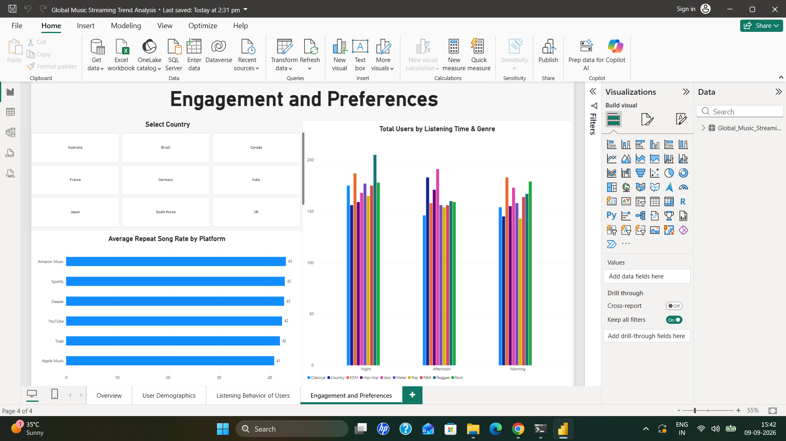

# 🎵 Global Music Streaming Trend Analysis

## 📌 Project Overview

This project analyzes global music streaming listener preferences to understand how users consume music across different platforms, genres, countries, age groups, subscription types, and listening times.

The project combines **Python-based exploratory data analysis** with an **interactive Power BI dashboard** to turn raw listener data into clear, business-oriented insights.

---

## 🎯 Project Objectives

The analysis focuses on six key questions:

1. What are the most popular music streaming platforms?
2. How does age impact music preferences?
3. What are the most streamed genres and artists?
4. How do Free and Premium users differ in streaming behavior?
5. What time of the day do users stream music the most?
6. Are there regional trends in music streaming preferences?

---

## 📊 Dataset

The dataset contains **5,000 listener records** and **12 variables** covering user demographics, streaming behavior, preferences, and engagement.

### Main Variables

| Variable | Description |
|---|---|
| `User_ID` | Unique listener identifier |
| `Age` | Age of the listener |
| `Country` | Listener's country |
| `Streaming Platform` | Music streaming platform used |
| `Top Genre` | Listener's preferred/top genre |
| `Minutes Streamed Per Day` | Daily streaming duration |
| `Number of Songs Liked` | Number of liked songs |
| `Most Played Artist` | Artist played most frequently |
| `Subscription Type` | Free or Premium subscription |
| `Listening Time` | Morning, Afternoon, or Night |
| `Discover Weekly Engagement (%)` | Engagement with Discover Weekly |
| `Repeat Song Rate (%)` | Percentage of repeated songs |

---

## 🔎 Data Quality Checks

The dataset was inspected before analysis.

- **5,000 records** were available.
- All 12 columns contained complete observations.
- No missing values were found.
- No duplicate rows were found.
- Data types were inspected using Pandas.
- Numerical variables were summarized using descriptive statistics.

---

## 🐍 Python Analysis

Python was used for data inspection, cleaning/validation, exploratory analysis, aggregation, and visualization.

### Libraries Used

- **Pandas** — data manipulation and analysis
- **NumPy** — numerical operations
- **Matplotlib** — data visualization
- **Seaborn** — statistical visualization
- **Jupyter Notebook** — analysis environment

The complete analysis is available in:

`notebook/Global_Music_Streaming_Listener_Preferences.ipynb`

---

## 📈 Key Analysis Areas

### 1. Streaming Platform Analysis

The project compares listener activity across major streaming platforms to understand platform-level usage patterns.

### 2. Age & Music Preferences

Listener age is analyzed alongside genre preferences and streaming behavior to identify differences between age groups.

### 3. Genre Analysis

Total streaming minutes are compared across genres to identify which genres contribute the most overall listening activity.

Based on the analysis, **Rock** has the highest total streamed minutes, followed by **Jazz** and **EDM**.

### 4. Artist Analysis

Artists are ranked using total streaming minutes.

The highest total streamed minutes in the analyzed data are associated with:

1. Bad Bunny
2. Adele
3. Dua Lipa
4. Post Malone
5. Taylor Swift

### 5. Free vs Premium Users

Subscription type is analyzed to compare listener behavior between Free and Premium users.

The dataset contains:

- **2,526 Premium users**
- **2,474 Free users**

### 6. Listening-Time Analysis

Users are grouped by their preferred listening period.

- **Night:** 1,745 users
- **Afternoon:** 1,634 users
- **Morning:** 1,621 users

Night is therefore the most common listening period in the dataset.

### 7. Regional Trends

Country-level analysis is used to explore differences in streaming preferences and behavior across regions.

---

## 📊 Power BI Dashboard

An interactive Power BI dashboard was created to present the analysis in a more user-friendly and business-oriented format.

The dashboard covers:

- **Overview**
- **User Demographics**
- **Listening Behavior**
- **Engagement**

### Dashboard Screenshots

#### Overview



#### User Demographics


#### Listening Behavior


#### Engagement



---

## 🧠 Key Insights

The analysis provides several useful observations:

- The dataset represents a broad range of listener ages, from **13 to 60 years**.
- Average daily streaming is approximately **309 minutes per user**.
- Average songs liked per user is approximately **254**.
- Average Discover Weekly engagement is approximately **50.3%**.
- Average repeat-song rate is approximately **42.4%**.
- Rock has the highest total streamed minutes among the analyzed genres.
- Bad Bunny has the highest total streamed minutes among the listed artists.
- Night is the most common listening period.
- Premium users slightly outnumber Free users in the dataset.

---

## 📁 Project Structure

```text
Global Music/
│
├── data/
│   └── Global_Music_Streaming_Listener_Preferences.csv
│
├── images/
│   ├── Overview.png
│   ├── Engagement.png
│   ├── Listening Behavior.png
│   └── User Demographics.png
│
├── notebook/
│   └── Global_Music_Streaming_Listener_Preferences.ipynb
│
├── Global Music Streaming Trend Analysis.pbix
│
└── README.md
```

---

## 🚀 How to Explore the Project

### Python Analysis

1. Open the Jupyter Notebook:
   `notebook/Global_Music_Streaming_Listener_Preferences.ipynb`
2. Make sure the dataset is available in the `data/` folder.
3. Run the notebook cells to reproduce the analysis.

### Power BI Dashboard

1. Open:
   `Global Music Streaming Trend Analysis.pbix`
2. Use the available dashboard pages and visual filters.
3. Explore listener demographics, listening behavior, and engagement patterns.

---

## 🛠️ Tools & Technologies

| Tool | Purpose |
|---|---|
| Python | Data analysis |
| Pandas | Data manipulation |
| NumPy | Numerical analysis |
| Matplotlib | Visualization |
| Seaborn | Visualization |
| Jupyter Notebook | Exploratory analysis |
| Power BI | Interactive dashboard |
| Git | Version control |
| GitHub | Project repository |

---

## 💡 Business Value

This type of analysis can help a music-streaming business understand:

- Which genres and artists drive the most listening activity
- How listening behavior differs across user segments
- Differences between Free and Premium users
- When users are most active
- How preferences vary by geography and age
- Where personalization and engagement opportunities may exist

---

## 👨‍💻 Author

**Himanshu Sharma**

Data Analyst | Python | SQL | Power BI | Data Visualization

---

## ⭐ Project Highlights

**End-to-end data analytics project combining:**

`Raw Data → Data Validation → Exploratory Data Analysis → Insights → Power BI Dashboard → Business Storytelling`
